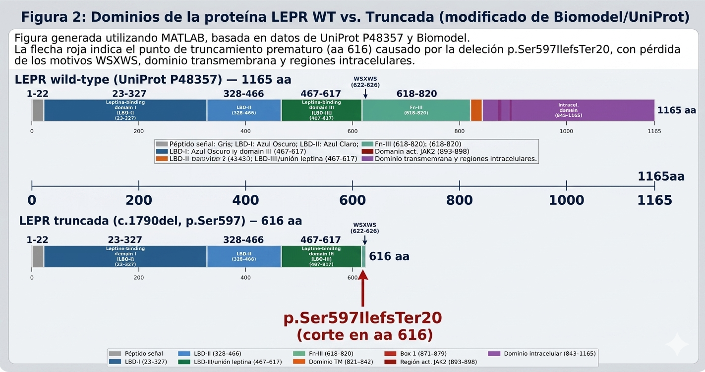

# MUBI-GeneticaClinica-Act3-Grupo4
Actividad 3 grupal - Anotación e interpretación de variantes | Máster Universitario en Bioinformática (UNIR) | Genética Clínica y de Poblaciones | Análisis de exoma (Abraham &amp; Maggie Simpson, GRCh38) | Grupo 4: Caren Moreno, Analia Pastrana, Ángel Guerrero

```
MUBI-GeneticaClinica-Act3-Grupo4/
│
├── README.md
│
├── datos/
│   ├── AbrahamSimpson.vcf
│   └── MaggieSimpson.vcf
│
├── anotacion_VEP/
│   ├── Abraham_VEP_output.txt
│   ├── Maggie_VEP_output.txt
│   ├── Abraham_VEP_summary.html
│   └── Maggie_VEP_summary.html
│
├── analisis/
│   ├── MC4R/
│   │   ├── clustal_omega_MC4R_Pro272_alignment.fasta
│   │   ├── clustal_omega_MC4R_resultado.png
│   │   └── uniprot_P32245_dominios.png
│   ├── LEPR/
│   │   ├── biomodel_LEPR_wt_traduccion.txt
│   │   ├── biomodel_LEPR_truncada_traduccion.txt
│   │   └── uniprot_P48357_dominios.png
│   ├── TP53/
│   │   └── notas_rs1042522_polimorfismo.md
│   └── MED12/
│       └── notas_VUS_MED12.md
│
├── capturas/
│   ├── VEP_Abraham_pantalla.png
│   ├── VEP_Maggie_pantalla.png
│   ├── gnomAD_MC4R.png
│   ├── gnomAD_LEPR.png
│   ├── OMIM_MC4R.png
│   ├── OMIM_LEPR.png
│   ├── KEGG_ruta_leptina_melanocortina.png
│   └── Reactome_MC4R_LEPR.png
│
├── informe/
│   ├── informe_completo_Act3_Grupo4.md
│   └── poster_Abraham_Maggie_Act3.pptx
│
└── referencias/
    └── referencias_bibliograficas.md
```

   # Anotación e interpretación de variantes — Actividad 3 Grupal

**Asignatura:** Genética Clínica y de Poblaciones  
**Máster:** Universitario en Bioinformática — UNIR  
**Grupo:** 4  
**Integrantes:** Caren Moreno · Analia Pastrana · Ángel Guerrero  

---

## Descripción

Análisis bioinformático de exoma completo de dos individuos de la familia
Simpson (Abraham y Maggie) a partir de archivos VCF, con anotación de
variantes mediante Ensembl VEP (GRCh38/hg38) e interpretación clínica
de las variantes identificadas en los genes MC4R, LEPR, TP53 y MED12.

---

## Variantes identificadas

| Gen   | Coordenada (GRCh38) | HGVS c.    | HGVS p.           | Tipo        | Clasificación   |
|-------|---------------------|------------|-------------------|-------------|-----------------|
| MC4R  | chr18:60371535      | c.815C>A   | p.Pro272His       | Missense    | Mutación        |
| LEPR  | chr1:65609984       | c.1790del  | p.Ser597IlefsTer20| Frameshift  | Mutación        |
| TP53  | chr17:7676154       | c.215G>A   | p.Pro72Leu        | Missense    | Polimorfismo    |
| MED12 | chrX:71121046       | c.629G>A   | p.Ala210Val       | Missense    | VUS             |

---

## Herramientas utilizadas

| Herramienta        | Uso                                      | URL                                      |
|--------------------|------------------------------------------|------------------------------------------|
| Ensembl VEP        | Anotación de variantes (GRCh38)          | https://www.ensembl.org/Tools/VEP        |
| gnomAD v4.1.1      | Frecuencias alélicas poblacionales       | https://gnomad.broadinstitute.org        |
| Clustal Omega      | Conservación del residuo (missense)      | https://www.ebi.ac.uk/Tools/msa/clustalo |
| UniProtKB          | Dominios proteicos                       | https://www.uniprot.org                  |
| Biomodel/Mutalyzer | Traducción proteína truncada (deleción)  | https://mutalyzer.nl                     |
| OMIM               | Patología y patrón de herencia           | https://www.omim.org                     |
| KEGG / Reactome    | Ruta molecular                           | https://www.genome.jp/kegg               |

---

## Estructura del repositorio

- `datos/` — Archivos VCF originales de Abraham y Maggie Simpson
- `anotacion_VEP/` — Outputs completos de Ensembl VEP
- `analisis/` — Resultados por gen: Clustal Omega, Biomodel, UniProt
- `capturas/` — Capturas de pantalla de todos los análisis realizados
- `informe/` — Informe completo en Markdown y póster en PPTX
- `referencias/` — Bibliografía utilizada

---

## Conclusiones principales

1. La obesidad en Abraham y Maggie se debe a **MC4R p.Pro272His**
   (autosómica dominante, heterocigosis en ambos).
2. Maggie es portadora de una deleción truncante en **LEPR**
   (autosómica recesiva, heterocigosis → no causal por sí sola).
3. Ambos genes integran el **eje leptina–melanocortina**.
4. TP53 p.Pro72Leu es polimorfismo benigno; MED12 p.Ala210Val es VUS.

---

## Licencia

Trabajo académico  UNIR 2026. Solo para uso educativo. 

# 🧬 Anotación e Interpretación de Variantes Genéticas - Familia Simpson
### Genética Clínica y de Poblaciones · Máster Universitario en Bioinformática · UNIR

> **Grupo 4** · Lote 2 (Par) · Equipo 4 (Par)  
> **Individuos analizados:** Abraham Simpson (abuelo) y Maggie Simpson (nieta)  
> **Autores:** Analia Pastrana Jiménez · Caren Moreno · Ángel Guerrero

---

## 📋 Descripción del proyecto

Este repositorio contiene el análisis completo de **anotación e interpretación de variantes genéticas** identificadas mediante **secuenciación de exoma completo (WES)** en dos miembros de la familia Simpson, en el marco de la Actividad Grupal 3 de la asignatura *Genética Clínica y de Poblaciones*.

El objetivo fue ponernos en el rol de genetistas clínicos para identificar, anotar e interpretar variantes detectadas en los archivos VCF de Abraham y Maggie Simpson, determinando su patogenicidad, el tipo de variante, el impacto sobre la proteína y la ruta molecular afectada, con el fin de establecer una hipótesis diagnóstica sobre la predisposición familiar a la obesidad.

---

## 📁 Estructura del repositorio

```
📦 variant-annotation-simpsons/
│
├── 📂 VCF/
│   ├── AbrahamSimpson.vcf          # Archivo de variantes de Abraham Simpson
│   └── MaggieSimpson.vcf           # Archivo de variantes de Maggie Simpson
│
├── 📂 VEP/
│   ├── AbrahamSimpson.vep          # Output completo de Ensembl VEP (Abraham)
│   └── MaggieSimpson.vep           # Output completo de Ensembl VEP (Maggie)
│
├── 📂 FASTA/
│   ├── fastagrupo                                          # Secuencias ortólogas MC4R para Clustal Omega
│   ├── fastaMutante                                        # Secuencia mutante MC4R p.(Pro272His)
│   ├── Homo_sapiens_ENSP00000299766_3_sequence.fa          # MC4R humano (proteína)
│   ├── Homo_sapiens_ENST00000349533_11_sequence.fa         # LEPR humano (proteína)
│   ├── Gallus_gallus_GCA_000002315.fa                      # MC4R Gallus gallus
│   ├── Loxodonta_africana_ENSLAFP00000016384_2_sequence.fa # MC4R Loxodonta africana
│   └── [+ 4 secuencias ortólogas adicionales]              # Ver carpeta FASTA/
│
├── 📂 Clustal_Omega/
│   └── alineamiento_MC4R_clustal_omega.png    # Alineamiento múltiple Pro272 conservada
│
├── 📂 Resultados/
│   ├── LEPR_dominios_wt_vs_truncada.png       # Proteína LEPR wt vs. truncada (Biomodel)
│   ├── ruta_metabolica.png                    # Ruta leptina-melanocortina (KEGG/Reactome)
│   ├── R-HSA-388596.pdf                       # Ruta Reactome: señalización leptina
│   ├── R-HSA-388596.png                       # Ruta Reactome (imagen)
│   ├── R-HSA-2586552.pdf                      # Ruta Reactome: señalización MC4R/AMPc
│   └── R-HSA-2586552.png                      # Ruta Reactome (imagen)
│
├── 📂 Anexos/
│   └── Anexos_Genetica_Poblaciones.docx       # Capturas: VEP, gnomAD, UniProt, Biomodel, KEGG
│
├── 📂 Poster/
│   └── Poster_Grupo4_Abraham_Maggie.pptx      # Póster científico final (entrega)
│
└── README.md                                  # Este archivo
```

---

## 🔬 Contexto biológico

La **obesidad monogénica** resulta de variantes en genes del **eje leptina–melanocortina**, la vía hipotalámica que regula el apetito y el balance energético. En esta cascada:

```
Tejido adiposo
     │
     ▼ (leptina)
   LEPR  ──► JAK2 ──► STAT3  ──► POMC
                                    │
                                    ▼ (α-MSH)
                                  MC4R  ──► AMPc/PKA
                                               │
                                               ▼
                                    SUPRESIÓN DEL APETITO
                                    ↑ GASTO ENERGÉTICO
```

Defectos en cualquier punto de esta cascada producen **hiperfagia y obesidad de inicio temprano**. Los genes analizados en este trabajo - **LEPR** y **MC4R** - son dos nodos críticos de este eje.

---

## 🧪 Metodología

### Herramientas utilizadas

| Herramienta | Versión/Ensamblado | Aplicación |
|---|---|---|
| **Ensembl VEP** | GRCh38 | Anotación de variantes, HGVS, SIFT, PolyPhen, gnomAD, 1000G |
| **gnomAD browser** | v4.1.1 | Frecuencias alélicas poblacionales |
| **Clustal Omega** | EBI | Alineamiento múltiple de secuencias ortólogas (conservación evolutiva) |
| **UniProtKB** | — | Dominios proteicos funcionales (P32245 MC4R · P48357 LEPR) |
| **Biomodel** | UAM | Traducción de proteína wt y truncada (frameshift) |
| **AlphaFold** | v2 | Predicción de estructura 3D de proteínas |
| **OMIM** | — | Asociación genotipo-fenotipo y patrón de herencia |
| **KEGG Pathways** | — | Rutas moleculares |
| **Reactome** | — | Rutas de señalización celular (R-HSA-388596, R-HSA-2586552) |
| **ClinVar / dbSNP** | — | Clasificación clínica de variantes |

### Flujo de análisis

```
VCF (Abraham + Maggie)
        │
        ▼
  Ensembl VEP (GRCh38)
  ─ Nomenclatura HGVS (c. y p.)
  ─ Transcrito MANE Select
  ─ SIFT / PolyPhen
  ─ Frecuencias gnomAD + 1000G
  ─ Cigosidad (campo AD del VCF)
        │
        ├──► Variante MISSENSE (MC4R)
        │         │
        │         ├─ Clustal Omega (conservación evolutiva Pro272)
        │         ├─ UniProt P32245 (dominio ECL3 / TM)
        │         ├─ AlphaFold (estructura 3D)
        │         └─ SIFT + PolyPhen (predicción patogenicidad)
        │
        └──► Variante FRAMESHIFT (LEPR)
                  │
                  ├─ Biomodel (proteína wt vs. truncada)
                  ├─ UniProt P48357 (dominios perdidos)
                  └─ OMIM + KEGG + Reactome (patología y ruta)
```

---

## 📊 Resultados

### Tabla 1. Variantes identificadas (GRCh38)

| Parámetro | MC4R | LEPR |
|---|---|---|
| **Posición (GRCh38)** | chr18:60,371,535 | chr1:65,609,983 |
| **Transcrito (MANE Select)** | NM_005912.3 / ENST00000299766.5 | NM_002303.6 / ENST00000349533.11 |
| **HGVS c.** | `c.815C>A` | `c.1790del` |
| **HGVS p.** | `p.(Pro272His)` | `p.(Ser597IlefsTer20)` |
| **Tipo de variante** | SNP - missense | Deleción - frameshift |
| **Cigosidad** | Heterocigoto (Abraham **y** Maggie) | Heterocigoto (solo Maggie) |
| **Frecuencia gnomAD v4** | **Ausente** (frec. = 0) | **Ausente** (frec. = 0) |
| **Frecuencia 1000G** | No reportada | No reportada |
| **Clasificación** | **MUTACIÓN** | **MUTACIÓN** |
| **SIFT** | 0 (Deleterious) | No aplica (frameshift) |
| **PolyPhen-2** | 1.0 (Probably damaging) | No aplica (frameshift) |
| **Proteína (UniProt)** | MC4R - P32245 | LEPR - P48357 |

### Tabla 2. Asociación a enfermedad (OMIM)

| Gen | Enfermedad | MIM fenotipo | MIM gen | Locus | Herencia |
|---|---|---|---|---|---|
| **MC4R** | Obesidad / deficiencia de MC4R (BMIQ20) | #618406 | 155541 | 18q21.32 | Autosómica dominante |
| **LEPR** | Obesidad mórbida por deficiencia del receptor de leptina | #614963 | 601007 | 1p31.3 | Autosómica recesiva |

### Tabla 3. Otras variantes identificadas

| Gen | HGVS c. | HGVS p. | Individuo | SIFT / PolyPhen | Clasificación | Relevancia |
|---|---|---|---|---|---|---|
| **TP53** | c.215C>G | p.(Pro72Leu) | Abraham y Maggie | Tolerado / Benigno | Polimorfismo (rs1042522) | Sin relación con obesidad |
| **MED12** | c.629C>T | p.(Ala210Val) | Abraham | No deleterious | VUS | Sin relación con obesidad |

---

## 🔴 Análisis MC4R - p.(Pro272His)

### Localización en la proteína

El receptor de melanocortina 4 (MC4R, UniProt P32245) es un receptor acoplado a proteína G (GPCR) con **7 dominios transmembrana**. La Pro272 se localiza en el **loop extracelular ECL3** (residuos 268–279), entre las hélices transmembrana TM6 (244–267) y TM7 (280–302).

```
   Extracelular
   ─────────────────────────────────────────────────
        ECL1      ECL2          ECL3 (↑ Pro272His)
         │         │              │
   ═══TM1═══  ═══TM3═══  ════TM5════  ════TM7════
   ═══TM2═══  ═══TM4═══  ════TM6════
   ─────────────────────────────────────────────────
   Intracelular
```

### Conservación evolutiva (Clustal Omega)

El alineamiento múltiple de secuencias ortólogas de MC4R en **7 especies** (de *Homo sapiens* a *Danio rerio*) demostró que **Pro272 está conservada en el 100% de las especies analizadas**, evidenciando una presión evolutiva extrema sobre este residuo.

> 📎 Ver: `Clustal_Omega/alineamiento_MC4R_clustal_omega.png`

<p align="center">
  
</p>

La **prolina** tiene una estructura cíclica única: su grupo amino forma parte de un anillo pirrolidina, lo que elimina el enlace N-H típico y le confiere rigidez estructural. Esto la convierte en un "rompehélices" que determina la curvatura precisa del loop ECL3. La sustitución **Pro→His** introduce un aminoácido con cadena lateral imidazólica, perdiendo completamente esta rigidez estructural y alterando la conformación del sitio de unión a α-MSH.

### Predicción de patogenicidad

| Predictor | Score | Interpretación |
|---|---|---|
| SIFT | 0.00 | **Deleterious** |
| PolyPhen-2 | 1.00 | **Probably damaging** |
| Frecuencia gnomAD | 0 (ausente) | Mutación rara |
| Conservación evolutiva | 100% | Residuo crítico |

### Visualización AlphaFold - MC4R

La estructura predicha por AlphaFold (AF-P32245) muestra que Pro272 forma parte del ápex del loop ECL3, donde interacciona con residuos adyacentes que contribuyen al bolsillo de unión del ligando. La sustitución por histidina desestabiliza este loop, reduciendo la afinidad del receptor por α-MSH y bloqueando la activación de la adenilato ciclasa.

> 💡 **Recomendación para visualizar en AlphaFold:**
> 1. Acceder a https://alphafold.ebi.ac.uk/entry/P32245
> 2. En el visor 3D, localizar la cadena en la posición 272
> 3. Colorear por confianza pLDDT: la región ECL3 muestra alta confianza (azul oscuro, pLDDT > 90)
> 4. Comparar la conformación del loop ECL3 en wt vs. mutante usando UCSF ChimeraX

---

## 🟡 Análisis LEPR - p.(Ser597IlefsTer20)

### Impacto de la deleción frameshift

La deleción `c.1790del` en LEPR (NM_002303.6) produce un **corrimiento del marco de lectura** desde el residuo Ser597, con aparición de un codón de parada prematuro en la posición Ter20 del nuevo marco de lectura. La traducción con **Biomodel** confirmó:

| | Proteína wt | Proteína truncada |
|---|---|---|
| **Longitud** | 1.165 aminoácidos | 615 aminoácidos |
| **Pérdida** | — | 550 residuos (47% de la proteína) |

### Dominios proteicos afectados (UniProt P48357)

```
LEPR wt (1165 aa):
[Signal]─[Unión leptina (467-484)]─[CRH1]─[FN-III]─[WSXWS]─[TM]─[Box1]─[JAK2]─[STAT3]
                                                                                         ▼
LEPR truncada (615 aa):
[Signal]─[Unión leptina (467-484)]─[CRH1]─[FN-III]─ ✂ CORTE EN aa 615
                                                    ↓
                           ✅ CONSERVA    |    ❌ PIERDE
                    ─────────────────────────────────────────────
                    Dominio unión leptina | Motivo WSXWS (622-626)
                    Región extracelular   | Dominio transmembrana
                                         | Motivo Box 1 (871-879)
                                         | Región activación JAK2 (893-898)
                                         | Dominio señalización STAT3
```

> 📎 Ver: `Resultados/LEPR_dominios_wt_vs_truncada.png`

<p align="center">
  
</p>

### Consecuencia funcional

El receptor truncado conserva la capacidad de **unirse a leptina** (dominio 467–484 intacto) pero es **completamente incapaz de transducir la señal intracelular** por pérdida de todos los dominios de señalización (transmembrana, JAK2, STAT3). Es una **pérdida de función total**.

### Visualización AlphaFold - LEPR

> 💡 **Recomendación para visualizar en AlphaFold:**
> 1. Acceder a https://alphafold.ebi.ac.uk/entry/P48357
> 2. Seleccionar la región 597–1165 para visualizar los dominios eliminados
> 3. El dominio transmembrana (TM) aparece como una hélice α compacta en la región ~800–820
> 4. Los dominios JAK2-binding (893–898) y Box1 (871–879) son regiones yuxtamembrana críticas
> 5. Para la proteína truncada: usar la secuencia de `fastaMutante` con AlphaFold Colab

---

## 🧬 Rutas moleculares

### Eje leptina–melanocortina (KEGG / Reactome)

> 📎 Ver: `Resultados/ruta_metabolica.png`  
> 📎 Ver: `Resultados/R-HSA-388596.pdf` (señalización leptina)  
> 📎 Ver: `Resultados/R-HSA-2586552.pdf` (señalización MC4R / AMPc)

```
                    TEJIDO ADIPOSO
                          │
                    [LEPTINA] ──────────────────────────────────────────────────┐
                          │                                                     │
                          ▼                                                     │
    NÚCLEO ARCUATO HIPOTALÁMICO                                                 │
                          │                                                     │
                    [LEPR-b] ──► JAK2 ──► pSTAT3 ──► POMC                     │
                          │                               │                     │
                          │                         [α-MSH / β-MSH]            │
                          │                               │                     │
                    NÚCLEO PARAVENTRICULAR                │                     │
                          │                               ▼                     │
                          │                         [MC4R] ──► Gαs ──► AMPc   │
                          │                                            │        │
                          │                                         [PKA]       │
                          │                                            │        │
                          │                                    SUPRESIÓN APETITO│
                          │                                    ↑ GASTO ENERGÉTICO
                          │                                                     │
                    ALSO: AgRP/NPY neurons (inhibidos por LEPR) ───────────────┘

━━━━━━━━━━━━━━━━━━━━━━━━━━━━━━━━━━━━━━━━━━━━━━━━━━━━━
VARIANTE MC4R p.(Pro272His) → RECEPTOR NO FUNCIONAL → NO AMPc → HIPERFAGIA
VARIANTE LEPR c.1790del → RECEPTOR TRUNCADO → NO JAK2/STAT3 → NO POMC
━━━━━━━━━━━━━━━━━━━━━━━━━━━━━━━━━━━━━━━━━━━━━━━━━━━━━
```

### Consecuencias moleculares

**MC4R p.(Pro272His):**
La señalización normal de MC4R requiere que α-MSH se una al receptor, produzca un cambio conformacional en los dominios transmembrana y active la proteína Gαs, que estimula la adenilato ciclasa para producir AMPc. El AMPc activa la quinasa PKA, que fosforila factores de transcripción que suprimen la ingesta y aumentan el gasto energético. La sustitución Pro272His en el loop ECL3 altera la conformación del sitio de unión, reduciendo drásticamente la afinidad por α-MSH y bloqueando toda esta cascada.

**LEPR p.(Ser597IlefsTer20):**
La isoforma larga del receptor de leptina (LEPR-b) activa JAK2 (constitutivamente asociado al receptor) al dimerizar tras la unión de leptina. JAK2 activa fosforilaciones en cadena que llevan a la fosforilación y activación de STAT3, el cual transloca al núcleo y activa la transcripción de POMC. Sin el dominio de activación de JAK2 (aa 893–898) ni los dominios transmembrana que permiten la dimerización del receptor, esta cascada no puede iniciarse.

---

## 🏥 Interpretación clínica

### Abraham Simpson

Porta en **heterocigosis** la variante **MC4R c.815C>A p.(Pro272His)**. Al tratarse de una patología **autosómica dominante** (OMIM #618406), una sola copia mutada es suficiente para producir el fenotipo: **obesidad de inicio variable con hiperfagia**. La transmisión vertical a su nieta Maggie es consistente con este patrón.

### Maggie Simpson

Porta **dos variantes** independientes:

1. **MC4R c.815C>A p.(Pro272His)** en heterocigosis - heredada de Abraham - responsable del fenotipo de obesidad (AD)
2. **LEPR c.1790del p.(Ser597IlefsTer20)** en heterocigosis - portadora, no causa fenotipo por ser AR - pero añade riesgo acumulativo si se expresara en homocigosis en generaciones futuras

El **fenotipo actual de Maggie** se explica principalmente por MC4R. La variante LEPR en heterocigosis la convierte en portadora de una segunda variante de pérdida de función que podría tener consecuencias en su descendencia.

### Otras variantes

| Variante | Individuo | Clasificación | Relevancia clínica |
|---|---|---|---|
| TP53 p.(Pro72Leu) | Abraham y Maggie | Polimorfismo benigno (rs1042522) | Frecuente en población; sin relación con obesidad |
| MED12 p.(Ala210Val) | Abraham | VUS | Sin evidencia de asociación a obesidad |

---

## 💡 Notas sobre visualización con AlphaFold

Para enriquecer el análisis estructural de las proteínas, recomendamos visualizar las estructuras en AlphaFold junto con las variantes identificadas:

### MC4R (P32245) — p.(Pro272His)
- URL: https://alphafold.ebi.ac.uk/entry/P32245
- Residuo de interés: **Pro272** en el loop ECL3
- Importancia: El ápex del loop ECL3 determina la especificidad de unión al ligando. La confianza pLDDT en esta región es alta (>85), indicando una predicción estructural robusta
- Comparar con estructura experimental: PDB 6W4Y (MC4R con agonista)

### LEPR (P48357) — p.(Ser597IlefsTer20)
- URL: https://alphafold.ebi.ac.uk/entry/P48357
- Región de interés: aa 597–1165 (región eliminada por el truncamiento)
- El dominio transmembrana (aa ~800–820) aparece como una hélice α de alta confianza
- Los dominios JAK2-activating (893–898) forman parte de la región citoplasmática yuxtamembrana
- La proteína truncada puede visualizarse generando la secuencia de 615 aa con Biomodel y subiéndola a AlphaFold Colab (https://colab.research.google.com/github/deepmind/alphafold/blob/main/notebooks/AlphaFold.ipynb)

---

## 📚 Referencias

1. Richards S, et al. Standards and guidelines for the interpretation of sequence variants. *Genet Med.* 2015;17(5):405-424. doi:10.1038/gim.2015.30

2. Tao YX. The melanocortin-4 receptor: physiology, pharmacology, and pathophysiology. *Endocr Rev.* 2010;31(4):506-543. doi:10.1210/er.2009-0037

3. Wabitsch M, et al. Biologically inactive leptin and early-onset extreme obesity. *N Engl J Med.* 2015;372:48-54. doi:10.1056/NEJMoa1406653

4. Clement K, et al. A mutation in the human leptin receptor gene causes obesity and pituitary dysfunction. *Nature.* 1998;392:398-401. doi:10.1038/32911

5. Funcke JB, Wabitsch M. Beyond leptin: coding and non-coding RNAs in the regulation of human energy homeostasis. *Obes Rev.* 2021;22(6):e13202. doi:10.1111/obr.13202

6. Ensembl Variant Effect Predictor (VEP). https://www.ensembl.org/Tools/VEP

7. Karczewski KJ, et al. (gnomAD Consortium). The mutational constraint spectrum quantified from variation in 141,456 humans. *Nature.* 2020;581:434-443. doi:10.1038/s41586-020-2308-7

8. Jumper J, et al. Highly accurate protein structure prediction with AlphaFold. *Nature.* 2021;596:583-589. doi:10.1038/s41586-021-03819-2

9. UniProt Consortium. UniProt: the Universal Protein Knowledgebase. *Nucleic Acids Res.* 2023;51(D1):D523-D531. doi:10.1093/nar/gkac1052

10. OMIM Entry #618406 — Obesity, BMIQ20 (MC4R). https://www.omim.org/entry/618406

11. OMIM Entry #614963 — Leptin receptor deficiency. https://www.omim.org/entry/614963

---

## 👥 Autores y contribuciones

| Autor | Contribución principal |
|---|---|
| **Analia Pastrana Jiménez** | Anotación VEP · Análisis gnomAD · Tabla de variantes |
| **Caren Moreno** | Análisis LEPR (Biomodel + UniProt) · Rutas moleculares · README |
| **Ángel Guerrero** | Análisis MC4R (Clustal Omega + AlphaFold) · Diseño del póster |

---

## 📄 Licencia

Este repositorio es de uso académico en el marco del Máster Universitario en Bioinformática de la Universidad Internacional de La Rioja (UNIR). Los datos utilizados corresponden a individuos ficticios de la familia Simpson y son de uso exclusivo docente.

---

*Máster Universitario en Bioinformática · UNIR · Curso 2026*  
*Asignatura: Genética Clínica y de Poblaciones*

---
## Poster

